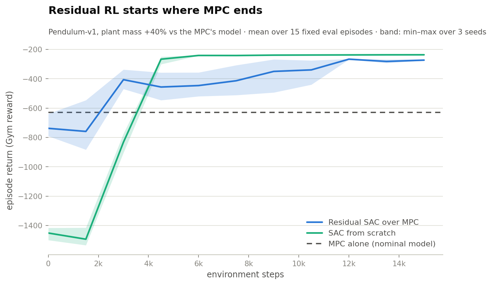
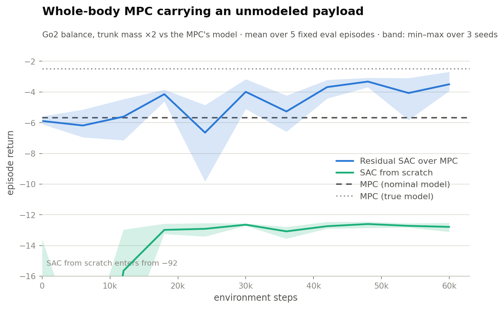
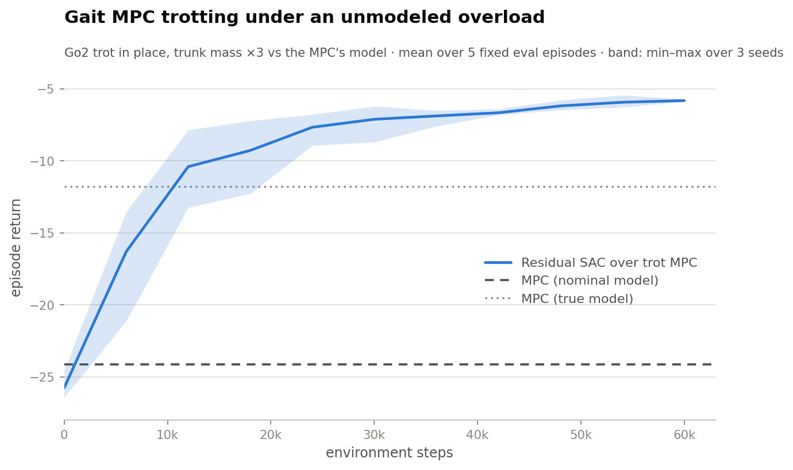

# blendmpc

[](https://github.com/assawayut/blendmpc/actions/workflows/ci.yml)
[](https://assawayut.github.io/blendmpc/)
[](LICENSE)

blendmpc implements four common ways of combining trajectory-optimization MPC
with reinforcement learning: residual RL on top of an MPC controller
([Johannink et al., 2019](https://arxiv.org/abs/1812.03201)), learned value
functions as MPC terminal costs
([Bhardwaj et al., 2021](https://arxiv.org/abs/2012.05909)), warm-starting the
solver with a learned policy, and collecting MPC rollouts to train imitation
policies. These patterns keep showing up in robotics papers as one-off
implementations; here they are ordinary library components that work with
[Gymnasium](https://gymnasium.farama.org/) environments, the
[Crocoddyl](https://github.com/loco-3d/crocoddyl) and
[acados](https://github.com/acados/acados) solvers, and any RL library that
consumes Gymnasium envs (the benchmarks use
[Stable-Baselines3](https://github.com/DLR-RM/stable-baselines3)).


*Unitree Go2 walking at 0.3 m/s under the whole-body gait MPC
(`CrocoddylCyclicMPC` + Crocoddyl, ~3 ms per solve at 50 Hz, MuJoCo plant).
Rendered by [benchmark/quadruped_trot/render.py](benchmark/quadruped_trot/render.py).*

<picture>
  <source media="(prefers-color-scheme: dark)" srcset="docs/assets/residual_pendulum_dark.png">
  
</picture>

*Residual SAC on Pendulum-v1 with the plant mass 40% higher than the MPC's
model. The residual agent starts near the MPC baseline and skips the initial
crash phase of SAC from scratch. Script: [benchmark/residual_pendulum](benchmark/residual_pendulum/).*

## Installation

```shell
git clone https://github.com/assawayut/blendmpc && cd blendmpc
pip install -e ".[crocoddyl,test]"
```

Not on PyPI yet. Crocoddyl installs from wheels; the acados backend
additionally needs the [acados C library](https://docs.acados.org/installation)
and is skipped everywhere (tests included) when absent.

## Usage

```python
import gymnasium as gym
import numpy as np

from blendmpc.blends import ResidualMPCEnv
from blendmpc.envs.pendulum import make_pendulum_problem, obs_to_state
from blendmpc.solvers.crocoddyl import CrocoddylMPC

mpc = CrocoddylMPC(lambda x0: make_pendulum_problem(x0, horizon=30))
env = ResidualMPCEnv(gym.make("Pendulum-v1"), mpc, obs_to_state)

obs, _ = env.reset(seed=0)
done = False
while not done:
    obs, reward, terminated, truncated, info = env.step(np.zeros(1))
    done = terminated or truncated
```

`env` is a normal Gymnasium environment whose action is a correction added to
the MPC, so the zero action above reproduces the plain controller (it swings
the pendulum up on its own). Training an agent on it works as usual:

```python
from stable_baselines3 import SAC
SAC("MlpPolicy", env).learn(total_timesteps=15_000)
```

See `examples/` and the [documentation](https://assawayut.github.io/blendmpc/)
for the other components.

## Components

- `ResidualMPCEnv` — Gymnasium wrapper implementing
  `u = clip(u_mpc + a_rl)`. Useful when the MPC's model is wrong in ways that
  are hard to write down (payload mass, friction, cable drag). Keep the
  residual authority at 1.0 unless you have a reason not to; a bounded
  correction cannot beat the base controller's ceiling.
- `make_learned_terminal` / `with_learned_terminal` — put a learned cost-to-go
  V(x) at the terminal node of a Crocoddyl problem, so a short horizon behaves
  like a long one. Takes analytic `grad_fn`/`hess_fn` (e.g. torch autograd);
  finite differences on a float32 network are too noisy to use.
- `PolicyWarmStartMPC` — roll out a policy to initialize the solver on cold
  starts. With `compare_with_default=True` it solves from both the policy seed
  and the solver's own init and keeps the cheaper solution.
- `collect_expert_dataset` — run the MPC in closed loop and record
  `(obs, u_mpc)` pairs for behavior cloning. Pass `policy=` to let the student
  drive while the MPC labels (DAgger-style).

Backends (`CrocoddylMPC`, `AcadosMPC`) share one interface,
`MPCPolicy.solve(x0, us_init, xs_init)`; the base class turns it into a
receding-horizon controller with warm-start shifting. Components only see
that interface, so adding a backend does not touch them.

## Benchmarks

Each component has a benchmark under `benchmark/` that reruns in minutes on a
CPU. Numbers below are mean return over 15 fixed evaluation episodes of the
pendulum swing-up (higher is better; a failed swing-up is roughly -1500).

| | result |
|---|---|
| MPC with 40% mass error | -629 |
| + residual SAC, 15k steps | -273 |
| SAC from scratch, 15k steps | -236 (first ~2.5k steps at ~-1450) |
| MPC, horizon 30 | -320, 14/15 swing-ups |
| MPC, horizon 8 | -1536, 0/15 |
| MPC, horizon 8 + learned V | -414, 14/15 (15/15 with a value-iteration V) |
| BC student of the MPC | -423 at 25x lower latency (0.6 ms → 24 µs) |

The same residual pattern on a real robot morphology — whole-body MPC on the
Unitree Go2 (37-dimensional state, 12 torques, 50 Hz, ~3 ms per solve),
carrying roughly its rated payload unmodeled
([benchmark/quadruped_balance](benchmark/quadruped_balance/)):

<picture>
  <source media="(prefers-color-scheme: dark)" srcset="docs/assets/quadruped_balance_dark.png">
  
</picture>

| | return |
|---|---|
| MPC, true-mass model | -2.49 |
| + residual SAC, 60k steps | -3.50 (best seed -2.69) |
| MPC, nominal model | -5.67 |
| SAC from scratch, 60k steps | -12.79 |

And with a gait: `CrocoddylCyclicMPC` advances a periodic contact schedule
through the receding horizon (`ShootingProblem.circularAppend`); with a
velocity command the swing-foothold schedule and base reference advance too,
and the robot walks (0.2–0.3 m/s tracked to within a few mm/s; the envelope
ends near 0.4 m/s). The benchmark below trots in place while carrying three
times its trunk mass unmodeled
([benchmark/quadruped_trot](benchmark/quadruped_trot/)). Here the learned
residual ends **twice as good as the true-model controller** — the remaining
error is contact timing, which no rigid-body parameter can fix:

<picture>
  <source media="(prefers-color-scheme: dark)" srcset="docs/assets/quadruped_trot_dark.png">
  
</picture>

| | return |
|---|---|
| + residual SAC, 60k steps | **-5.81** |
| Trot MPC, true-mass model | -11.79 |
| Trot MPC, nominal model | -24.12 |

Some observations from producing these, written up in the benchmark READMEs:

- What looks like the solver getting stuck in a local minimum is often the
  objective itself: from a hanging start, staying down genuinely costs less
  than swinging up over a 1.5 s horizon. Warm-start seeding cannot fix this;
  a terminal value function can.
- Warm-starting a receding-horizon MPC from its own shifted solution can lock
  in whatever the first solve found. A small nonzero cold-start control gets
  out of stationary points; re-seeding from a policy at every step made
  closed-loop performance worse in all runs.
- One round of MSE DAgger made the distilled student worse, not better. The
  expert is close to bang-bang, so student-visited states get contradictory
  labels and the regression averages them into torques that mean nothing.
- The terminal value function has to be trained in the same cost units the
  OCP uses. Fitting it to the environment's reward (differently scaled,
  kinked at the hanging angle) quietly breaks it.
- On the quadruped, residual authority works the other way around from the
  pendulum: large residuals let exploration noise knock the robot over and
  training data becomes mostly falls. And per-step rewards that are tiny
  against SAC's entropy bonus quietly pay the policy to stay noisy — scale
  training rewards before blaming the blend.

## Related projects

- [mpcrl](https://github.com/FilippoAiraldi/mpc-reinforcement-learning) and
  [mpc4rl](https://arxiv.org/abs/2501.15897) treat the MPC itself as the
  function approximator and let RL tune its parameters (Gros & Zanon).
  blendmpc keeps the controller and the policy separate instead; the two
  approaches are complementary.
- [Crocoddyl](https://github.com/loco-3d/crocoddyl) and
  [acados](https://github.com/acados/acados) do the actual optimization.

## Roadmap

Planned: a PyPI release, faster gaits, and lateral/turning commands. Contributions are
welcome, in particular new solver backends and patterns from papers you want
reusable — see [CONTRIBUTING.md](CONTRIBUTING.md).

## Citing

If you use blendmpc in your research, please cite it via
[CITATION.cff](CITATION.cff) (the "Cite this repository" button on GitHub).
